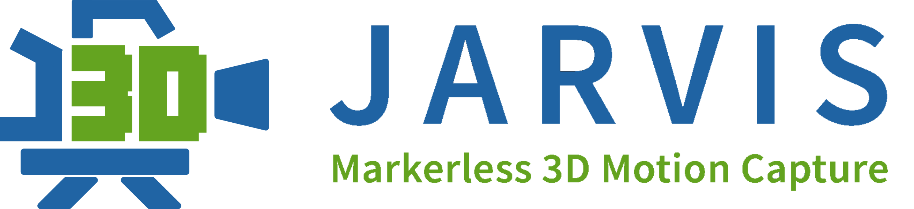

# JARVIS - 3D markerless motion capture made easy
JARVIS (Joint Acquisition, Recording and Voxel based Inference System) aims to make neural network based 3D markerless pose estimation easy. From calibrating your 
camera system to muscoskeletal model fitting, we plan to provide easy to use software and hardware for every step along the way. 
 - Our Acquisition Tool allows you to record synchronised videos from multiple views at hight FPS thanks to GPU accelerated online JPEG compression. 
 - The Annotation Tool is a convenient way to extract and annotate training sets for our state of the art 3D pose estimation network. 
 - Vortex is our voxel reprojection based tracking engine that enables highly precise markerless motion capture - even in scenarios with heavy occlusion

This Project is currently still under developement and will be fully up and running in the next few months!
