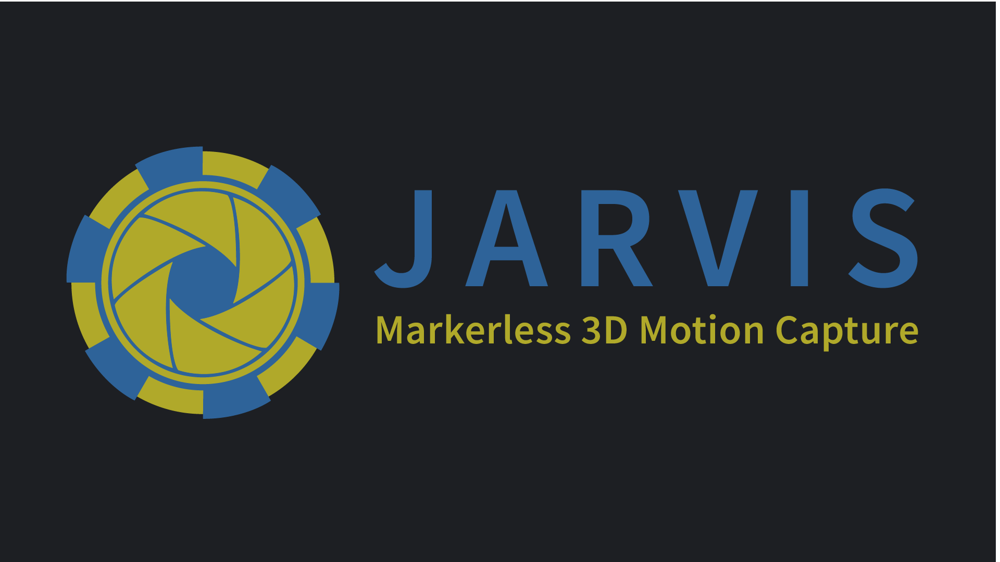

# JARVIS - 3D markerless motion capture made easy
**JARVIS** (**J**oint **A**cquisition, **R**ecording and **V**oxel based **I**nference **S**ystem) aims to make neural network based 3D markerless pose estimation easy. From calibrating your 
camera system to final 3D predictions, we to provide easy to use software for every step along the way. 
 - Our **[AcquisitionTool](https://github.com/JARVIS-MoCap/JARVIS-AcquisitionTool)** allows you to record **synchronised videos from multiple views at high FPS** thanks to GPU accelerated online JPEG compression. 
 - The **[AnnotationTool](https://github.com/JARVIS-MoCap/JARVIS-AnnotationTool)** is a convenient way to **extract and annotate training sets** for our state of the art 3D pose estimation network. 
 - **[HybridNet](https://github.com/JARVIS-MoCap/JARVIS-HybridNet)** is our hybrid 2D- and 3D-CNN based network architecture that enables **highly precise markerless motion capture** - even in scenarios with heavy occlusion and complex natural environments.

Check out **[https://jarvis-mocap.github.io/jarvis-docs/](https://jarvis-mocap.github.io/jarvis-docs/)** for more information about designing a 3D motion capture setup and our **Getting Started Guide**.

## Contact
The toolbox was developed at the **Neurobiology Lab of the German Primate Center ([DPZ](https://www.dpz.eu/de/startseite.html))**.
If you have any questions or other inquiries related to JARVIS please contact:

Timo Hüser - [@hueser_timo](https://mobile.twitter.com/hueser_timo) - timo.hueser@gmail.com

## License

Distributed under LGPL. See `LICENSE.txt` for more information.
